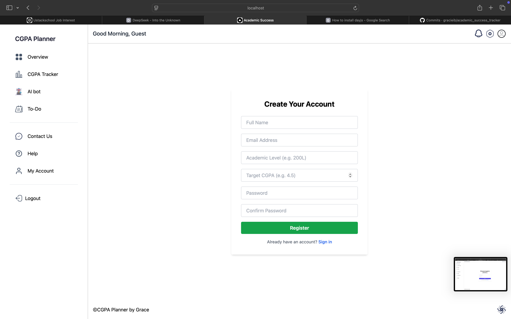
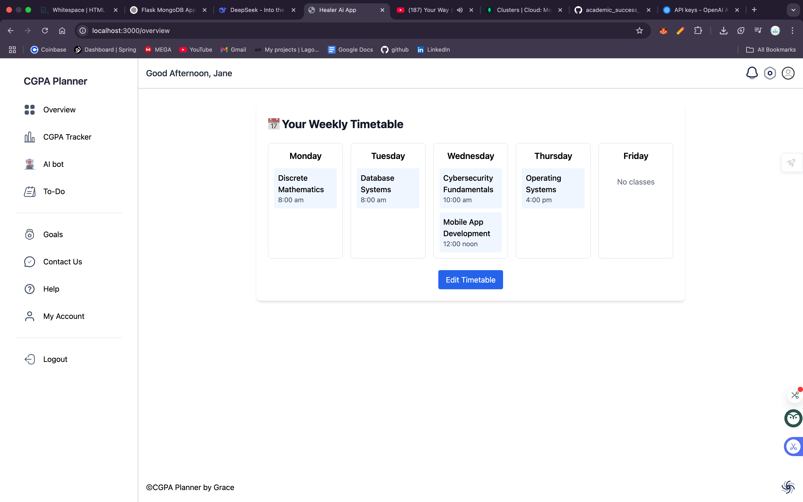
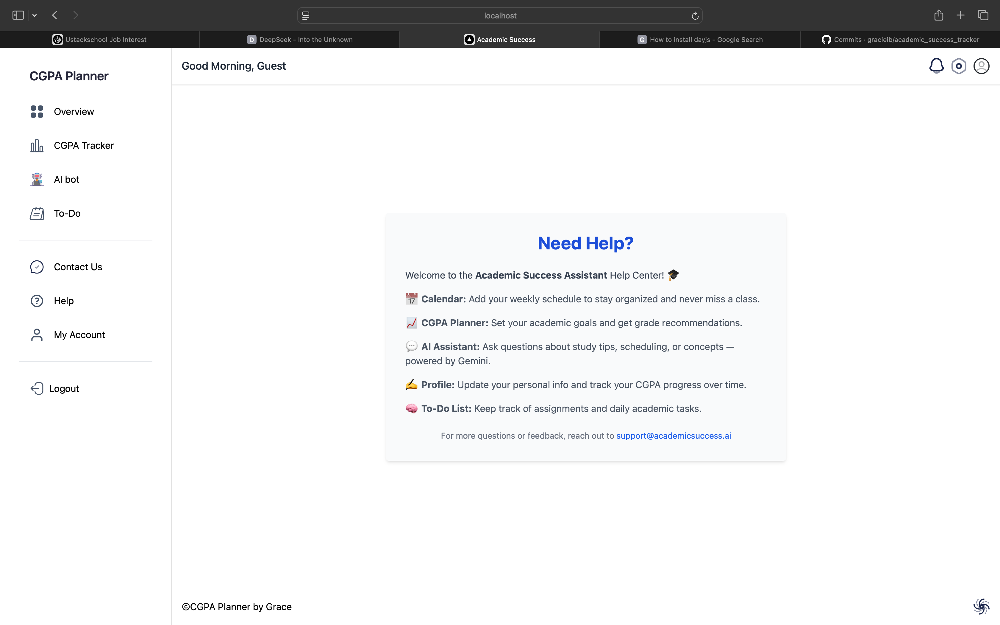

# 🎓 Academic Success Tracker

An intelligent academic assistant that helps students manage their schedules, track CGPA goals, organize tasks, and access AI-powered academic support.

---

## 🚀 Features

- 🛂 User Authentication (Register & Login)
- 👤 Student Profile with course scheduling
- 🎯 CGPA Planner with grade targets and insights
- ✅ To-Do list in calendar view
- 🤖 AI Study Assistant (Markdown-enabled)
- 📊 Visual overview of academic data

---

## 🛠️ Tech Stack

- **Frontend**: [Next.js](https://nextjs.org/) (App Router), [Tailwind CSS](https://tailwindcss.com/)
- **Backend**: [Flask](https://flask.palletsprojects.com/), [MongoDB](https://www.mongodb.com/)
- **AI**: Custom NLP model with Markdown formatting
- **Storage**: MongoDB (for user data) + LocalStorage (for to-dos)

---

## 🖼️ Screenshots

### 👨🏻‍💻 Login Page


---

### 🛂 Register Page


---

### 👤 Profile Page  
Users can add courses, days, and time slots.  


---

### 📈 Overview Page  
Timetable view with a simplified daily agenda.  


---

### 🎯 CGPA Planner  
Auto-loads courses, sets target grades, and shows real-time GPA projections.  


---

### ✅ To-Do Calendar  
Organize and visualize tasks day-by-day in a monthly view.  


---

### 🤖 AI Study Bot  
Get answers to academic questions in markdown format.  


---

### 🛠️ Help


---

## 🧰 Getting Started

### 📦 Clone and Setup

```bash
# 1. Clone the repo
git clone https://github.com/your-username/academic-tracker.git
```

```bash
# 2. Install frontend dependencies
cd frontend
npm install
```

```bash
# 3. Run frontend
npm run dev
```

```bash
# 4. Navigate to backend directory
cd ../backend
```

```bash
# 5. Install Python dependencies
pip install -r requirements.txt
```

```bash
# 6. Run Flask server
python app.py
```

---

### 📄 License
MIT License
© 2025

---

### 🙌 Contributing
Pull requests are welcome. For major changes, please open an issue first to discuss what you would like to change.